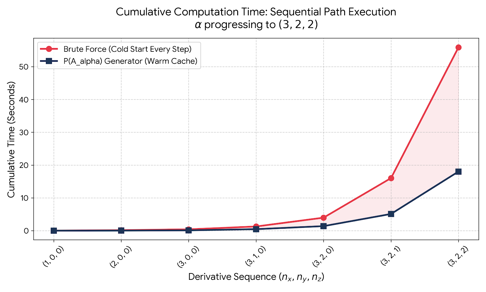
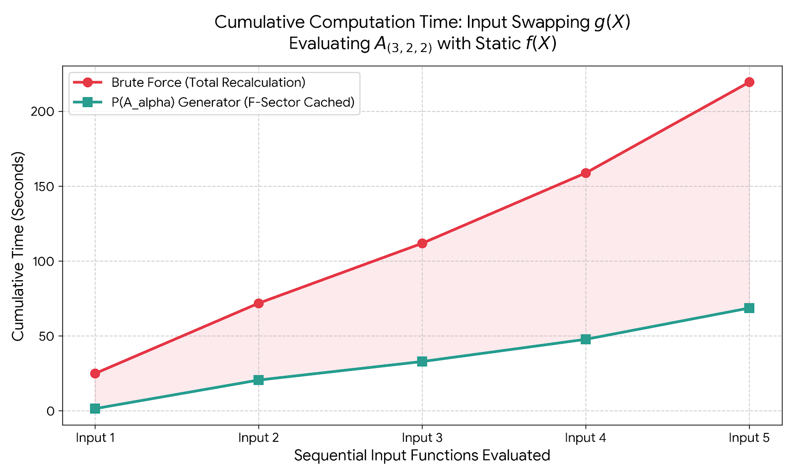

* **DOI / Zenodo Badge:** (Placeholder for the v2.0.0 release link)

# **Log-Tower-Generator Framework (v2.0.0)**

The **Log-Tower-Generator** is an advanced symbolic and computational engine designed to calculate the exact $n$-th order mixed partial derivatives of multidimensional Log-Tower functions.

Specifically, it provides a closed-form, algorithmic solution for evaluating complex jet space structures of the form:

$$A = h(X)\frac{\ln g(X)}{\ln f(X)}$$

### **The Bottleneck**

In standard computational mathematics, evaluating high-order mixed partials of nested rational functions triggers a massive combinatorial explosion. Repeatedly applying the quotient and chain rules across multiple orthogonal dimensions forces computer algebra systems to build exponentially large, highly redundant expression trees that quickly consume memory and hang the processor.

### **The v2.0.0 Solution**

Version 2.0.0 completely bypasses these traditional algebraic bottlenecks. By deploying a **Chronological Step-Operator Engine**, the framework maps a strictly constrained index set ($\mathcal{A}_\alpha$) to elegantly navigate the multi-index space. It decouples the denominator's mathematical "drag" into a persistent tensor cache, reducing calculation times for complex 4D derivatives from minutes to milliseconds and opening the door for extreme high-order parameter sweeps.

---

## **Features (What's New in v2.0.0)**

The Log-Tower-Generator has been completely re-architected from the ground up, transitioning from the 1-D mathematical framework of v1.0.0 into a fully optimized, $n$-dimensional jet space engine.

* **Multidimensional Jet Space Support:** Upgraded to handle high-order mixed partial derivatives across any number of orthogonal dimensions (e.g., $x, y, z, t$) using strict multi-index notation ($\alpha$).
* **Chronological Step-Operator Engine:** Completely bypasses the combinatorial explosion caused by standard quotient-rule applications and generic geometric index loops. By utilizing Anchor and Historical Web logic, the engine enforces a strict spatial gradient sequence, generating only chronologically valid paths.
* **Asymmetric Tensor Caching ($\Omega^\alpha_\beta$):** The master equation strictly decouples the structural "drag" of the denominator $f(X)$ from the forcing input of the numerator $g(X)$. The $F$-sector states are cached independently, meaning sequential derivative mapping and input-swapping operations require only a fraction of standard brute-force computation time.
* **The Spine Projection Corollary:** Introduces a direct algebraic pathway to evaluate the exact multidimensional derivative of the logarithmic scaffold ($R_\alpha = \Gamma_\alpha - R \Phi_\alpha$), completely bypassing the scaling sector $h(X)$ when only the core ratio is required.
* **SymEngine (C++) Integration:** The recursive core of the generator now leverages SymEngine's ultra-fast C++ backend. Heavy multi-index calculations (such as an 8th-order, 4D $A_{(2,2,2,2)}$ tree containing tens of thousands of terms) are generated in milliseconds, easily outpacing pure SymPy brute-force cold starts by 40% or more.

---

## **Motivation**

Directly differentiating "Log-Tower" expressions of the form $A = h \frac{\ln g}{\ln f}$ leads to a severe combinatorial explosion. In a single-variable context, the raw higher-order derivatives quickly become opaque. This complexity scales exponentially with added dimensions, tangling the multi-index contributions of $f$, $g$, and $h$ into complex, unstructured expressions.

The **Log-Tower-Generator v2.0.0** resolves combinatorial explosion by mapping spatial gradients into a canonical normal form over a **multidimensional jet space** for mixed partial derivatives, extending the stable F/G-sector symmetry into $n$-dimensions. By isolating the distinct "forcing" and "decay" dynamics across any orthogonal variable, the framework reorganizes the expansion into:

* **Sector Decomposition:** Splitting the multidimensional solution into a homogeneous $\Phi_\alpha$ sector and a particular $\Gamma_\alpha$ sector.
* **Chronological Routing:** Bypassing processor-intensive Bell polynomial combinatorics and generic geometric bounding. The new architecture uses a **Chronological Step-Operator Engine** to construct a **Constrained Index Set** ($\hat{A}_\alpha$), eliminating path-independent "phantom states" from the calculation.
* **Tensor Caching:** Pre-calculating the system's multidimensional "Drag" as a cached F-Kernel ($\Omega^\alpha_\beta$) across a tensor grid, independent of the input signal.
* **Linear Superposition:** Generating the final mixed partial differential $P(A_\alpha)$ as a clean linear combination of these modular, $w$-rooted components.

This approach reveals deep structural symmetries in multivariate derivative towers. It provides a lightning-fast, closed-form mapping mechanism that draws parallels to Lie-operator expansions, offering highly optimized solutions for symbolic computation, differential algebra, and asymptotic analysis.

---

## Use Cases & Applications

The $P(A_\alpha)$ generator is a remarkably versatile piece of mathematical architecture. Because it perfectly maps the exact topological gradients of logarithmic-fractional functions without the combinatorial explosion that usually blocks this kind of math, it scales seamlessly from pure theoretical proofs to physical engineering problems.

### 1. Machine Learning & Computational Architecture
* **Physics-Informed Neural Networks (PINNs):** Acts as a custom gradient layer to replace standard Automatic Differentiation (AutoDiff). By computing exact, high-order mixed partial derivatives natively as vectorized tensor convolutions, it eliminates the exponential memory costs and numerical instability inherent in deep physical simulations.
* **Memoized Tensor Caching:** Utilizes the forward-filling multidimensional $\Omega$ cache to feed pre-computed lower-order states into the network, drastically accelerating the backward pass.

### 2. Applied Physics, Geophysics & Astrophysics
* **Astrophysics (Compressible Navier-Stokes):** Utilizes the dynamic gas density field as the amplitude modulator $h(X)$ to map the violently shifting fractal geometries of supernova shockwaves, the viscous shear in black hole accretion disks, and the supersonic interstellar turbulence driving molecular cloud collapse.
* **Spatiotemporal Turbulence (Fluid Dynamics):** Maps the constantly shifting, multidimensional scaling exponents of turbulent kinetic energy using massive continuous datasets like the Johns Hopkins Turbulence Databases.
* **Dynamic Fractal Complexity:** Calculates the higher-order spatial gradients of structural breakdown in complex, evolving climate systems, such as sea ice fragmentation or cloud cover perimeters.
* **Econophysics (Non-Linear Elasticity):** Functions as a precision tool to extract the high-order sensitivities (the "Greeks") of multi-variable market elasticity and demand surfaces from high-frequency trading data.

### 3. Advanced Industrial & Mechanical Engineering
* **Advanced Manufacturing (Cold Spray):** Maps the exact aerodynamic shear forces and shock diamond expansions in supersonic metal powder deposition nozzles.
* **Industrial Power Generation:** Isolates the complex mixed-partial derivatives of shockwaves interacting with the boundary layers of transonic turbine blades to predict microscopic metal fatigue.
* **Medical Technology:** Models the physical fragmentation and multidimensional dispersion boundaries of highly compressible, supersonic liquid streams in needle-free jet injectors.
* **Structural Safety (Blast Mitigation):** Isolates the exact nodes of maximum multidimensional shear force in refracting, non-linear explosive shockfronts as they interact with physical infrastructure.

### 4. Aerospace Engineering
* **Hypersonic Boundary Layer Transition:** Pinpoints the exact high-order geometric inflection points where plasma boundary layers fracture into turbulence over re-entry vehicles and scramjets.
* **Rocket Engine Combustion Instability:** Maps the precise spatial gradients of acoustic pressure amplification inside liquid rocket combustion chambers to disrupt resonant feedback loops.
* **Aeroacoustics (Supersonic Jet Noise):** Extracts the exact multidimensional source terms of damaging Mach wave radiation and acoustic frequencies born from turbulent exhaust plumes.

### 5. Pure Mathematics
* **Differential Algebra & Picard-Vessiot Theory:** Acts as a master theorem for the ideal generated by logarithmic-fractional functions. By assembling $\Gamma_\alpha$ and $\Phi_\alpha$ via the $\Omega$-governed constrained tensor summations over $\hat{A}_\alpha$, it generates closed-form algebraic blueprints required to prove whether complex PDEs have exact Liouvillian solutions.
* **Analytic Number Theory:** Extracts exact, high-order arithmetic residues of multi-variable zeta functions without generating path-independent geometric errors.
* **Complex Geometry:** Isolates the non-vanishing curvature terms of complex manifolds (the Levi form) to precisely calculate high-order topological invariants near logarithmic asymptotes.

---

## **Core Objects**

Let $\alpha = (\alpha_1, \alpha_2, \dots, \alpha_d)$ be a multi-index defining a spatial gradient across a set of orthogonal variables $X = (x_1, x_2, \dots, x_d)$.

For the multidimensional expansion, we define our base functions and modular components as follows:

* **The Base & Input:** $f(X)$, $g(X)$, and $h(X)$ are differentiable multivariate functions.
* **The Spine ($R_\alpha$):** The $\alpha$-th mixed partial derivative of the logarithmic scaffold $\frac{\ln g(X)}{\ln f(X)}$.
* **The Scaling Module ($h_\alpha$):** The $\alpha$-th mixed partial derivative of the exponent function $h(X)$.
* **The Base Module ($F^{(w)}_\alpha$):** The $\alpha$-th mixed partial derivative of $\frac{f_w}{f \ln f}$, representing the relative rate of change of the base, strictly rooted in dimension $w$.
* **The Input Module ($G^{(w)}_\alpha$):** The $\alpha$-th mixed partial derivative of $\frac{g_w}{g \ln f}$, representing the relative rate of change of the input, strictly rooted in dimension $w$.

To manage the combinatorial complexity of the expansion, we define three structural operators that absorb all induced cross-sector structure and form the backbone of the canonical expansion:

* **$\Gamma_\alpha$ (The G-Sector):** The recursive multidimensional polynomial state accounting for the forcing input of the numerator.
* **$\Phi_\alpha$ (The F-Sector):** The homogeneous component accounting for the internal dynamics of the denominator.
* **$\Omega^\alpha_\beta$ (The F-Kernel):** A cached tensor grid representing the system's "drag," calculated completely independent of the input signal.

Finally, to cleanly navigate the jet space, we introduce:

* **The Constrained Index Set ($\hat{A}_\alpha$):** A strictly bounded set of chronologically valid coordinates generated by the Anchor and Historical Web logic, bypassing generic geometric loops to eliminate path-independent phantom states.

---

## **Domain Constraints**

To ensure the multidimensional Log-Tower expression $A(X) = h(X) \frac{\ln g(X)}{\ln f(X)}$ remains well-defined across the spatial domain, the following conditions must be satisfied for all points in $X$:

* **Positivity:** Both $f(X) > 0$ and $g(X) > 0$ must hold to satisfy the requirements of the real-valued natural logarithm.
* **Non-Vanishing Denominator:** $f(X) \neq 1$ is required to prevent a zero-valued denominator in the quotient $\ln f(X)$.
* **Multivariate Singularity Analysis:** Special consideration is required along any spatial gradient where $f(X) \to 1$, $f(X) \to 0$, or $g(X) \to 0$. Depending on the local behavior of $h(X)$ and the directional logarithmic growth rates, these regions may represent functional poles, branch cuts, or removable singularities requiring multidimensional limit-based evaluation.

---

## **The $P(A_\alpha)$ Jet Space Generator**

For any multi-index $\alpha > 0$, the $P(A_\alpha)$ generator evaluates the mixed partial differential of the multidimensional Log-Tower function. Specifically, it generates partial differentials of the form:

$$ \frac{\partial^{(n_{x_1}+n_{x_2}+\dots+n_{x_m})}}{\partial x_1^{n_{x_1}}\partial x_2^{n_ {x_2}}\dots\partial x_m^{n_{x_m}}} \left(h(x_1,x_2,\dots,x_m)\frac{\text{ln}g(x_1,x_2,\dots,x_m)}{\text{ln}f(x_1,x_2,\dots,x_m)}\right)$$

Where $f(X)$, $g(X)$, and $h(X)$ are $m$-dimensional differentiable functions.

### **The Conceptual Form (Sector Decomposition)**

To understand the structural symmetry of the derivatives, the generator can be expressed as a linear superposition of multi-index convolutions. Utilizing the generalized Leibniz rule, the polynomial is assembled by separating the distinct "forcing" and "decay" sectors:

$$P(A_\alpha) = R \left[ h_\alpha - \sum_{\beta < \alpha} \binom{\alpha}{\beta} h_\beta \Phi_{\alpha - \beta} \right] + \sum_{\beta < \alpha} \binom{\alpha}{\beta} h_\beta \Gamma_{\alpha - \beta}$$

This cleanly maps how the individual modular components contribute to the total jet space structure:

* **Raw $h$-sector ($h_\alpha$):** The direct $\alpha$-th mixed partial derivative of the scaling function $h(X)$.
* **Recursively corrected F-sector ($\Phi_\alpha$):** The homogeneous component accounting for the internal dynamics of the denominator $f(X)$.
* **Recursively corrected G-sector ($\Gamma_\alpha$):** The particular component accounting for the forcing input of the numerator $g(X)$.

### **The Computational Form (The Master Equation)**

Because the multidimensional module states are strictly anchored by the base cases $\Phi_\emptyset = -1$ and $\Gamma_\emptyset = 0$, the raw scaling sector is completely absorbed into the boundary of the summation.

This collapses the entire expansion into a single, highly efficient computational form:

$$P(A_\alpha) = \sum_{\beta \le \alpha} \binom{\alpha}{\beta} h_\beta \big( \Gamma_{\alpha-\beta} - R \Phi_{\alpha-\beta} \big)$$

By utilizing this canonical framework, the $P(A_\alpha)$ generator maps the mixed partial derivatives directly. It completely bypasses the combinatorial tangles of repeatedly applying the quotient rule across multiple orthogonal axes, yielding an elegant, closed-form expansion ready for algorithmic evaluation.

---

## **The Engine: Anchor/Web Logic & Tensor Caching**

While the $P(A_\alpha)$ generator maps the master superposition, generating the underlying $\Gamma_\alpha$ and $\Phi_\alpha$ states in multidimensional jet space requires carefully navigating the derivative routing history.

In v1.0.0, the single-variable expansion relied heavily on generic index bound loops which produce invalid, path-independent mixed-partial branches in a multidimensional environment. While Bell set partitions present a solution that navigates this path dependency, they can lead to combinatorial explosion. Instead v2.0.0 utilizes a **Chronological Step-Operator Engine**.

This engine enforces a strict right-to-left spatial gradient sequence (e.g., $x \to x \to y \to y$), where the root axis $w$ of any module is dictated strictly by this chronology rather than abstract geometry.

### **The Constrained Index Set ($\hat{A}_\alpha$)**

Instead of calculating all possible geometric partitions and filtering them, the engine directly constructs a strictly bounded **Constrained Index Set** ($\hat{A}_\alpha$) of chronologically valid jet space coordinates.

For every dimension $k$ where $\alpha_k > 0$, the set is generated by the union of two path-dependent subsets:

1. **The Anchor State ($\mathcal{S}_{k, \text{anchor}}$):** The upper chronological boundary where the current root axis is shifted by exactly one derivative, and all prior axes have reached their target state.
2. **The Historical Web ($\mathcal{S}_{k, \text{web}}$):** The cumulative routing history where the root axis accounts for the remaining lower-order derivatives, and prior axes occupy any valid state within their bounds.

$$\hat{A}_\alpha = \bigcup_{\substack{k=1 \\ \alpha_k > 0}}^d \left( \mathcal{S}_{k, \text{anchor}} \cup \mathcal{S}_{k, \text{web}} \right)$$

### **The Multidimensional F-Kernel ($\Omega^\alpha_\beta$)**

To evaluate the paths defined by $\hat{A}_\alpha$, the system separates the "Input Signal" ($G$) from the "System Structure" ($\Omega$).

The coefficients $\Omega^\alpha_\beta$ represent the multidimensional "Drag" of the system—purely a function of the denominator $f(X)$. They form a stable tensor grid that is cached and reused to build both sectors. The entire kernel is populated by the recursive convolution:

$$\Omega^\alpha_\beta = - \sum_{0 \leq \gamma \leq \beta - e_w} \binom{\alpha-e_w}{\gamma} F^{(w)}_\gamma \Omega^{\alpha - e_w - \gamma}_{\beta - e_w - \gamma}$$

(With the base case $\Omega_\emptyset^\alpha = 1$)

### **Constrained Sector Accumulation**

With the $\hat{A}_\alpha$ index set mapped and the $\Omega$ tensor cached, the combinatorial tangles are completely eliminated. The engine evaluates the master polynomial states over this constrained path using localized discrete convolutions.

The G-sector and F-sector states are seamlessly accumulated as:

$$\Gamma_\alpha = \sum_{(x_k, \beta) \in \hat{A}_\alpha} G^{(x_k)}_{\beta} \Omega_{\alpha - \beta}^\alpha$$

$$\Phi_\alpha = \sum_{(x_k, \beta) \in \hat{A}_\alpha} F^{(x_k)}_{\beta} \Omega_{\alpha - \beta}^\alpha$$

By evaluating only the valid anchor and web states, the algorithm dynamically prunes the dependency tree, allowing for the lightning-fast generation of high-order mixed partial sequences.

---


## **Corollary: The Spine Projection**

Because the $P(A_\alpha)$ generator is built on the closed modular alphabet, this multidimensional derivative structure also implies that the "Spine" derivative $R_\alpha$ (the mixed partial derivative of the logarithmic scaffold $\frac{\ln g}{\ln f}$) is simply the projection of the sectors onto the base.

Assuming the final step of the spatial gradient is taken with respect to dimension $w$, the $\alpha$-th derivative of the spine is given by:

$$P(R_\alpha) = \Gamma_{\alpha} - R \Phi_{\alpha}$$

This confirms that the complex behavior of the underlying logarithmic ratio is deterministically evolved from the exact same cached $\Omega$ tensor and constrained $\hat{A}_\alpha$ index set as the master Log-Tower function itself.

---

## **Performance Benchmarks**

The v2.0.0 architecture completely bypasses the combinatorial explosion inherent to standard quotient-rule applications by decoupling the mathematical drag of the denominator into the $\Omega^\alpha_\beta$ tensor cache.

### **1. The "Warm Cache" Flatline**
When mapping a chronological sequence of multi-index derivatives, the standard brute-force method curves upwards exponentially as it reconstructs the quotient tree from scratch. The $P(A_\alpha)$ generator pulls from the persistent F and G sectors, reducing the calculation time of subsequent high-order states to effectively zero.



### **2. Isolating the Drag (Input Swapping)**
Because the F-sector's recursive shift operator ($\Phi_\alpha$) is mathematically blind to the numerator, the heavy computational drag of $f(X)$ is cached once and never recalculated. When evaluating a new input function $g(X)$ against a static base, the generator avoids massive redundant processing.



---

## **Walkthrough & Documentation**

The full narrative of how these equations were derived—spanning from the 1-D F/G-sector origins in v1.0.0 to the fully optimized, multidimensional jet space architecture of v2.0.0—is available in the repository documentation.

The walkthrough is broken down into 8 parts and covers:

* The foundational proofs for the closed alphabet and F/G-sector symmetry.
* The transition from standard recursive algorithms to discrete convolution.
* The pruning of generic geometric index loops and Bell set partitions.
* The formal Python implementation of the Chronological Step-Operator Engine and the $\hat{A}_\alpha$ constrained cache.

You can begin reading the documentation [here](https://github.com/Graham-Cat/Log-Tower-Generator/tree/main/walkthrough).

---

## **Installation & Quick Start**

### **Prerequisites**

* Python 3.8 or higher
* Git

### **Installation**

Clone the repository and install the framework via pip. The core package automatically installs `sympy` and `symengine`.

```bash
# Clone the repository
git clone https://github.com/Graham-Cat/Log-Tower-Generator.git
cd Log-Tower-Generator

# Install the core engine
pip install .

# Optional: Install with testing and visualization tools
pip install .[test,viz]

```

### **Quick Start**

The v2.0.0 architecture uses a persistent class-based state machine (`LogTowerGenerator`) to maintain the $\Omega^\alpha_\beta$ tensor cache.

Here is a minimal example calculating a 3D mixed-partial derivative:

```python
import symengine as se
from log_tower_generator import LogTowerGenerator

# 1. Define the spatial dimensions and pure abstract functions
x, y, z = se.symbols('x y z')
f = se.Function('f')(x, y, z)
g = se.Function('g')(x, y, z)
h = se.Function('h')(x, y, z)

# 2. Instantiate the Chronological Step-Operator Engine
generator = LogTowerGenerator((x, y, z), f, g)

# 3. Define the multi-index for the derivative (e.g., a 4th-order mixed partial)
alpha = (2, 1, 1)

# --- Option A: The Spine Bypass ---
# Calculates P(R_alpha) directly, bypassing the multi-index convolution loop
poly_R_alpha = generator.get_R_alpha(alpha)
print(f"P(R_alpha) = {poly_R_alpha}")

# --- Option B: The Master Generator ---
# Calculates P(A_alpha) using the complete h(X) convolution sequence
poly_A_alpha = generator.get_A_alpha(alpha, h)
print(f"P(A_alpha) = {poly_A_alpha}")

```

For a more comprehensive walkthrough of the engine's output formatting and SymPy handoffs, run the included `demo.py` script.

---

## **Contributing**

Contributions are welcome.
Open an issue or submit a pull request if you have:

- mathematical insights
- simplifications
- symbolic optimizations
- documentation improvements


## License

This project utilizes a dual-license strategy to cover both the software implementation and the theoretical work:

### Software (Code)
The source code (files within `src/` and `tests/`) is licensed under the **MIT License**. See the `LICENSE` file for details.

### Content (Theory & Documentation)
The mathematical derivations, "Walkthrough" narratives, diagrams, and theoretical discoveries (specifically the F/G-sector symmetry and related alphabet) are licensed under a **Creative Commons Attribution 4.0 International License (CC BY 4.0)**.


[](http://creativecommons.org/licenses/by/4.0/)

**Attribution:** If you adapt or redistribute the theoretical concepts from this repository, please cite as:

Feick, Christopher. (2026). Log-Tower-Generator: A Multidimensional Jet Space Engine for High-Order Mixed Partial Derivatives. GitHub. https://github.com/Graham-Cat/Log-Tower-Generator
